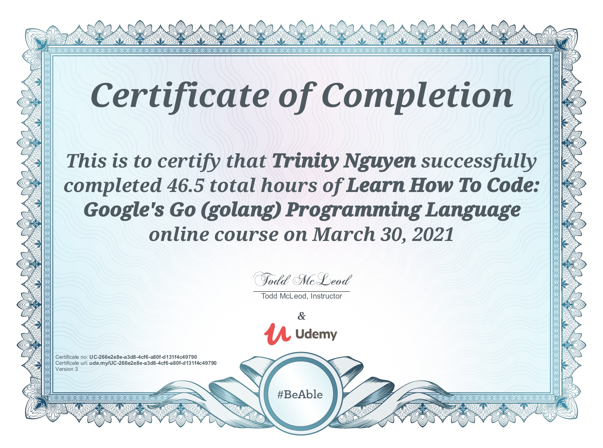
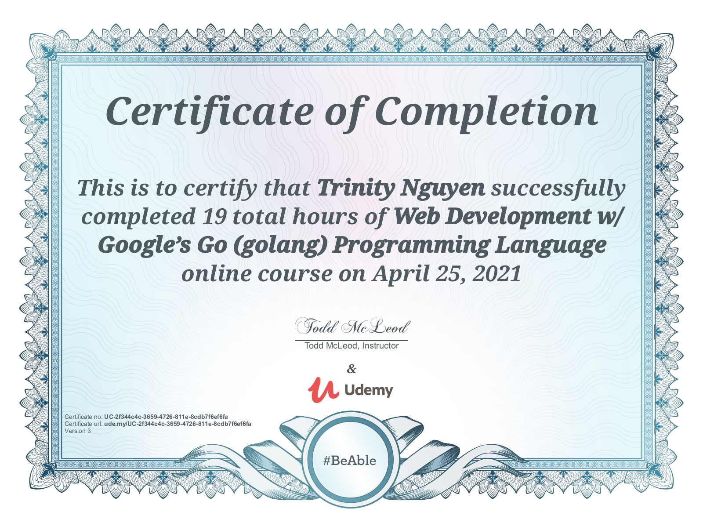

# learn-go

## Re-learn and master Golang through 2 Udemy Course 

1. [Learn How To Code: Google's Go (golang) Programming Language](https://www.udemy.com/course/learn-how-to-code/) by [Todd McLeod](https://github.com/GoesToEleven)

2. [Web Development w/ Google’s Go (golang) Programming Language](https://www.udemy.com/course/go-programming-language/) by [Todd McLeod](https://github.com/GoesToEleven)

### In these 2 courses I learn:

- Learn Golang from beginning to advanced concepts
- Construct server-side applications using today's best practices
- Understand servers, routing, restful applications, JSON, AJAX, templates, file servers, cookies, state, UUIDs, HTTP methods, HTTP response codes, sessions, Amazon Web Services, MySQL, MongoDB, load balancers, HTTPS & TLS, Docker, Containers, Virtual Machines, Google Cloud, and App Engine
- Create web applications using only the Go programming language's standard library
- Create web applications without using third-party frameworks
- Apply cutting-edge web development practices
- Acquire an outstanding foundation in the fundamentals of web programming
- Achieve mastery in the understanding and application of web development
- Build performant distributed applications that dynamically scale

### Here are my Certificates for completing these 2 courses:

1. [Learn How To Code: Google's Go (golang) Programming Language](https://www.udemy.com/certificate/UC-266e2e8e-a3d8-4cf6-a80f-d131f4c49790/)

 

2. [Web Development w/ Google’s Go (golang) Programming Language](https://www.udemy.com/certificate/UC-2f344c4c-3659-4726-811e-8cdb7f6ef6fa/)

